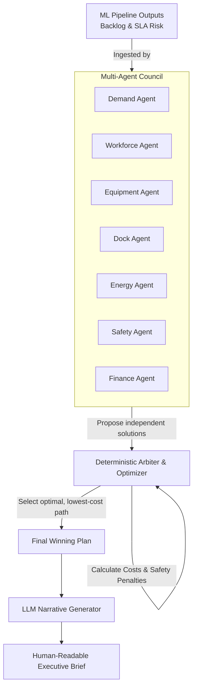
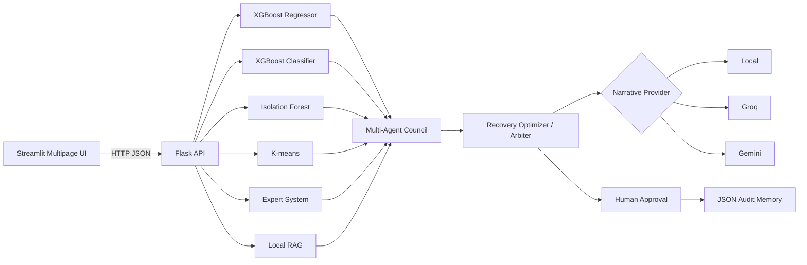

> **Workforce AI Suite integration:** This directory is embedded as page 6 through `../pages/06_FulfillTwin_AI.py`. The merged suite defaults to the in-process `fulfilltwin/local_client.py`, so a second Flask service is not required. The standalone launch files remain for reference and independent use.

# FulfillTwin AI

**Human–Robot Workforce Digital Twin and Incident Commander**


*(Placeholder: Add screenshot of the Control Tower live dashboard here)*


*(Placeholder: Add screenshot of the Scenario Lab execution pipeline here)*

FulfillTwin AI is a production-oriented portfolio capstone that simulates fulfillment-center disruptions, forecasts their impact, retrieves internal operating guidance, convenes a multi-agent specialist council, compares recovery plans, and preserves every decision in auditable JSON memory.

## The Problem: Why FulfillTwin AI?

Modern fulfillment centers are incredibly complex, high-speed environments. When a sudden disruption occurs—like a massive order surge, a conveyor belt breakdown, or an unexpected labor shortage—managers are forced to make split-second decisions that cost thousands of dollars. 

Historically, warehouse managers have relied on static dashboards and gut instinct. Generative AI alone isn't enough to solve this, because LLMs are notoriously bad at supply-chain physics and raw math. 

FulfillTwin AI was built as a capstone project to bridge this gap. It proves that by combining traditional Machine Learning (for hard math), multi-agent orchestration (for specialized reasoning), and strict human-in-the-loop governance, AI can act as a highly reliable "Incident Commander" during chaotic supply chain emergencies.

## What exactly does it do?

FulfillTwin AI acts as an end-to-end digital twin and recovery engine:
1. **Live Monitoring:** Ingests live data streams from the warehouse floor.
2. **Disruption Mapping:** Allows users to map physical emergencies (e.g., "Critical Conveyor Failure") directly into a simulated digital twin.
3. **Mathematical Forecasting:** Uses XGBoost and K-Means models to accurately predict how bad the resulting backlog will be and whether the warehouse will breach its Service Level Agreements (SLAs).
4. **Agentic Problem Solving:** Convenes a council of 7 specialized AI agents (Workforce, Demand, Safety, Dock, etc.) to debate and propose competing recovery plans.
5. **Cost Optimization:** Runs a deterministic optimizer to pick the cheapest, safest recovery plan.

## Guardrails & Memory

In high-stakes enterprise environments, AI cannot be a "black box" that operates without supervision. FulfillTwin AI enforces strict safety protocols:

* **Expert System Guardrails:** Before the LLM can generate a narrative, a hard-coded Python expert system checks the proposed plan. If the AI suggests an unsafe action (like pushing conveyor belts past 100% capacity or ignoring safety incident protocols), the Expert System explicitly flags and blocks it.
* **Human-in-the-Loop Approval:** The AI is strictly advisory. Any major intervention—especially involving labor reallocation, overtime, or significant cost—requires explicit human approval through the UI before it is executed.
* **Immutable JSON Audit Memory:** Every single disaster scenario, model prediction, AI recommendation, and human approval is permanently recorded in a thread-safe JSON memory store. This ensures 100% traceability for post-incident audits.

## Why this is not just another chatbot

The LLM is an optional narrative and coordination layer. The measurable operational intelligence comes from traditional ML, deterministic rules, retrieval, and transparent optimization:

| Capability | Implementation |
|---|---|
| Future backlog | XGBoost regressor |
| SLA-breach probability | XGBoost classifier |
| Out-of-distribution operating state | Isolation Forest |
| Operating-regime discovery | K-means clustering |
| Safety and operating constraints | Internal expert system |
| Policy evidence | Local TF-IDF RAG over Markdown playbooks |
| Recovery strategy | Transparent candidate-plan cost optimizer |
| Narrative providers | Local expert system, Groq, or Gemini |
| Durable memory | Atomic, thread-safe JSON decision store |

The bundled models train on synthetic data on first startup. For production use, replace the synthetic generator with site-specific historical events and retrain.

## Multi-Agent Orchestration & Decision Making

FulfillTwin AI uses a specialized multi-agent architecture. Rather than relying on a single monolithic LLM prompt to solve a massive supply chain disaster, the system breaks the problem down into isolated domains:



**How they come to a conclusion:**
1. **Independent Evaluation:** Each of the 7 agents looks at the initial Machine Learning forecasts independently. The Finance agent proposes cost-cutting, while the Workforce agent proposes calling in extra labor. 
2. **The Arbiter (Optimizer):** Instead of letting the LLMs argue with each other (which is slow and prone to hallucination), FulfillTwin uses a hard-coded **Deterministic Arbiter**. 
3. **Scoring & Optimization:** The Arbiter ingests all the competing agent proposals and mathematically simulates their outcomes. It assigns a financial "Cost" and "Throughput Gain" to every possible combination of interventions (e.g., paying for overtime vs. paying SLA penalties for late packages).
4. **The Final Plan:** The Arbiter mathematically selects the single most optimal, lowest-cost, safest path to recovery. 
5. **Narrative Generation:** Only *after* the math is finalized does the system hand the winning plan back to the LLM to write a human-readable Executive Brief.

## Pages

- **Control Tower** — live operational view of warehouse events and recent decisions. **Features interactive "Incident Triggers": clicking a high-severity live event automatically maps its physical parameters directly to the Scenario Lab for immediate AI response planning.**
- **Scenario Lab** — disruption controls, model execution, plan comparison. Can be run manually via sliders or triggered dynamically from live events on the Control Tower.
- **Agent Council** — specialist reports, rules, RAG evidence, approval status
- **Knowledge Center** — searchable internal operating playbooks
- **Model Ops** — metrics, model card, retraining, JSON memory

## Architecture



## Machine Learning Pipeline

Generative AI (LLMs) are historically poor at performing raw mathematical calculations. FulfillTwin AI solves this by executing a traditional, deterministic Machine Learning pipeline *first*, and then feeding those hard numbers into the Agent Council. 

1. **XGBoost Regressor:** Takes the live warehouse parameters (order volume, absenteeism, etc.) and predicts the exact numerical **Future Backlog**.
2. **XGBoost Classifier:** Uses the same inputs to predict the percentage probability of an **SLA Breach** (packages shipping late).
3. **K-Means Clustering:** Analyzes the overall "shape" of the current parameters and groups them into a specific **Operating Regime** (e.g., "High Stress", "Normal Operations"). This gives the human manager a high-level categorization of the disaster before they even read the numbers.
4. **Isolation Forest:** Acts as an anomaly detector, flagging if the current disaster is completely out-of-distribution compared to historical training data.

By running these models first, the AI Agents build their recovery plans based on mathematically sound supply-chain forecasts rather than LLM hallucinations.

## Local setup

```bash
python -m venv .venv
# Windows: .venv\Scripts\activate
# macOS/Linux: source .venv/bin/activate
pip install -r requirements.txt
copy .env.example .env   # Windows
# cp .env.example .env   # macOS/Linux
./start.sh
```

On Windows PowerShell, run the services separately:

```powershell
$env:API_PORT="5000"
python run_api.py
```

Then in a second terminal:

```powershell
$env:FULFILLTWIN_API_URL="http://127.0.0.1:5000"
streamlit run streamlit_app.py
```

Open `http://localhost:8501`.

## LLM configuration

Local mode needs no key. To enable provider-backed executive briefs, add one or both keys to `.env` or your deployment variables:

```dotenv
GROQ_API_KEY=...
GEMINI_API_KEY=...
```

Provider failures automatically fall back to the deterministic local brief. The selectable model lists are environment variables so model availability can be updated without modifying code.

## Railway deployment

1. Push this directory to GitHub.
2. Create one Railway service from the repository.
3. Add `GROQ_API_KEY` and/or `GEMINI_API_KEY` if desired.
4. Railway uses `Dockerfile` and `start.sh`: Flask runs internally on port 5000 and Streamlit uses Railway's public `PORT`.
5. Keep `FULFILLTWIN_API_URL=http://127.0.0.1:5000`.

## Tests

```bash
pytest -q
```

## Governance

- AI recommendations are advisory.
- Overtime, major labor reassignment, or high-risk recovery requires human approval.
- Do not use the system for individual worker scoring or discipline.
- Synthetic-model performance is demonstration evidence, not production validation.
"# FulfillTwin_AI" 
