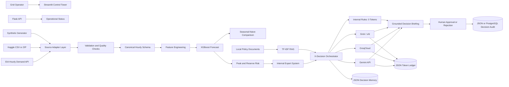
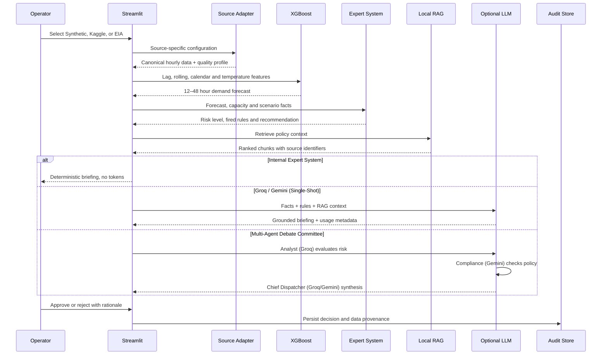
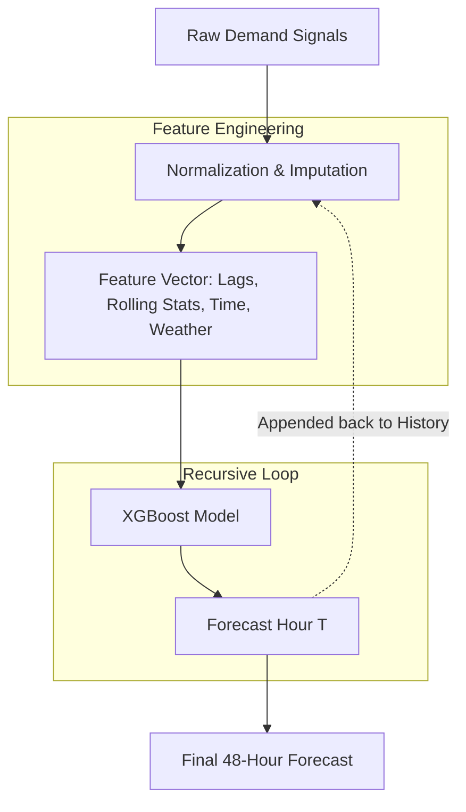

# GridGuard AI

**Explainable Grid Forecasting and Human-Governed Decision Intelligence**

[](#streamlit-interface)
[](#flask-api)
[](#forecasting-and-model-governance)
[](#three-source-data-architecture)
[](#local-rag)
[](#persistence)
[](#railway-deployment)

GridGuard AI is a portfolio-ready decision-support application that forecasts the next **12–48 hours** of electricity demand, identifies peak-risk periods, explains the evidence behind a recommendation, and requires a human operator to approve or reject the proposed response.

The application can ingest and normalize three different data-source types:

1. **Synthetic Demo** — reproducible offline data and controlled stress scenarios.
2. **Kaggle Historical** — uploaded or locally configured CSV/ZIP data for multiyear training and backtesting.
3. **EIA Live** — recent hourly balancing-authority demand retrieved through the EIA API.

All three source adapters produce the same canonical hourly schema before feature engineering, model training, risk assessment, RAG retrieval, and X-Decision reasoning.

The numerical forecast and decision explanation are intentionally separated:

- **XGBoost** predicts future demand.
- A deterministic **internal expert system** converts forecast conditions into transparent operational rules.
- **Local RAG** retrieves relevant policy and governance material.
- Optional **Grok, Groq, or Gemini** providers turn grounded evidence into an operator briefing.
- A human operator remains responsible for every recorded decision.

> GridGuard is an operational analytics demonstration. It does not autonomously control generation, transmission, customer load, or critical infrastructure.

---

## Feature summary

| Area | Feature | Status |
|---|---|---|
| UI | Streamlit grid-operations control tower | Completed |
| API | Flask/Waitress health, readiness, data-source, audit, memory and token endpoints | Completed |
| Data | Three-way source switch: Synthetic / Kaggle / EIA | Completed |
| Data | Synthetic ISO New England-style hourly generator | Completed |
| Data | Kaggle CSV and ZIP upload | Completed |
| Data | Kaggle local-file configuration | Completed |
| Data | Automatic timestamp, MW series and optional temperature detection | Completed |
| Data | Multi-series selection for PJM-style Kaggle files | Completed |
| Data | Missing-hour detection, interpolation/drop/error policy and quality flags | Completed |
| Data | EIA balancing-authority demand connector | Completed |
| Data | Common canonical schema and source profile | Completed |
| Forecast | XGBoost recursive 12–48 hour load forecast | Completed |
| Benchmark | Seasonal-naive weekly-lag baseline | Completed |
| Governance | Chronological holdout evaluation | Completed |
| Risk | Peak, capacity, reserve-margin and high-risk-hour assessment | Completed |
| Scenarios | Temperature, generation-outage and demand-shock simulation | Completed |
| Decisions | X-Decision hybrid decision system | Completed |
| Expert system | Deterministic rules with fired-rule trace and confidence | Completed |
| RAG | Local Markdown/text retrieval with source chunk identifiers | Completed |
| Memory | JSON-backed bounded decision conversation memory | Completed |
| LLM switch | Internal Expert System / Grok / Groq / Gemini | Completed |
| Token control | Prompt, completion, total-token and request counters | Completed |
| Token control | Provider-specific and global reset buttons | Completed |
| Human control | Approve/reject workflow with rationale | Completed |
| Persistence | Local JSON decision audit | Completed |
| Persistence | Optional Railway PostgreSQL decision audit | Completed |
| Deployment | Dockerfile and Railway configuration | Completed |
| Future | Real weather, outage, generation and interchange feeds | Planned |
| Future | Calibrated forecast intervals and champion–challenger models | Planned |
| Future | Authentication, model registry and background retraining | Planned |

---

## Technology stack

```text
Streamlit                     Operator interface and dashboards
Flask + Waitress              Health, readiness and operational API
pandas / NumPy                Hourly data preparation and adapters
scikit-learn                  Metrics, TF-IDF RAG and cosine retrieval
XGBoost + SHAP                Demand forecasting and feature importance
Plotly                        Interactive charts
requests                      EIA, xAI, Groq and Gemini REST calls
SQLAlchemy + Psycopg 3        Optional PostgreSQL persistence
JSON files                    Local decisions, memory and token ledger
```

GridGuard deliberately keeps **Streamlit + Flask** because that is the fastest route from a portfolio MVP to a deployable application without rewriting the frontend.

---

## Architecture



---

## End-to-end data flow



---

# Three-source data architecture

The data-source dropdown is displayed prominently in the Streamlit sidebar. A dedicated **Data Sources** tab shows all three inbound sources, identifies the active source, reports whether each source is ready, and displays the active source's quality profile. It also allows operators to export both the historical training data and the generated forward forecast directly as CSV files for offline analysis.

```text
Synthetic generator ─┐
Kaggle CSV / ZIP ────┼──> Source adapter ──> Validation ──> Canonical schema ──> XGBoost
EIA hourly API ──────┘
```

GridGuard trains on **one selected source at a time**. This prevents unrelated grid regions and incompatible demand scales from being combined without an explicit normalization strategy.

## Canonical schema

Every adapter returns these fields:

| Column | Purpose |
|---|---|
| `timestamp` | Hourly observation converted to UTC |
| `demand_mw` | Electricity demand/load target in MW |
| `temperature_f` | Observed temperature or a clearly identified seasonal proxy |
| `region` | Balancing authority or historical demand series |
| `is_holiday` | Calendar indicator used during feature engineering |
| `source` | Traceable data-source identifier |
| `data_quality_status` | `observed`, `interpolated`, or `synthetic` |

The active-source profile also records:

- original and usable row counts;
- invalid rows removed;
- duplicate timestamps removed;
- missing hours detected;
- interpolated hours;
- missing-data policy;
- temperature source;
- date range;
- region;
- selected Kaggle table and columns when applicable;
- Kaggle timezone assumption.

## 1. Synthetic Demo

No file, credential, or internet connection is required. Instead of returning random numbers, the `generate_synthetic_demand()` function in `backend/data.py` uses a time-series simulation powered by `numpy` and `pandas` to construct a realistic grid dataset:

- **Time and Base Patterns:** It generates an hourly timeline using Gaussian (bell-curve) patterns for typical human behavior: a morning peak (8:00 AM), a larger evening peak (6:00 PM), an overnight dip (3:00 AM), and a flat demand reduction on weekends.
- **Weather Simulation:** It synthesizes a temperature curve using sine waves, combining a yearly seasonal trend (hotter in summer) with a daily cycle (peaking at 2:00 PM), plus random noise.
- **Temperature-Driven Demand:** It models heating and cooling loads by aggressively increasing demand when the temperature exceeds 72°F (cooling), and moderately increasing demand when it drops below 45°F (heating).
- **Stress Events & Noise:** It calculates a slow, gradual growth trend over time and randomly injects "stress events" (sudden surges in power demand lasting 8 to 30 hours) to simulate extreme grid conditions.
- **Final Assembly:** These elements are summed together with a baseline demand (~14,500 MW) and background noise. It enforces a minimum limit of 7,000 MW, formats it into the standard GridGuard dataset schema, and tags it as `ISNE-SYNTHETIC`.

Here is a quick example of what the generated data looks like:

| timestamp | demand_mw | temperature_f | region | is_holiday | source | data_quality_status |
|---|---|---|---|---|---|---|
| 2026-07-03 07:00:00+00:00 | 15887.45 | 59.60 | ISNE-SYNTHETIC | 0 | synthetic:iso-ne-style | synthetic |
| 2026-07-03 08:00:00+00:00 | 15307.68 | 56.40 | ISNE-SYNTHETIC | 0 | synthetic:iso-ne-style | synthetic |
| 2026-07-03 09:00:00+00:00 | 16099.05 | 60.58 | ISNE-SYNTHETIC | 0 | synthetic:iso-ne-style | synthetic |

Synthetic mode is intended for:

- offline demonstrations;
- UI testing;
- scenario testing;
- controlled stress cases;
- reproducible examples.

It is explicitly labelled synthetic and is not presented as real-world model validation.

## 2. Kaggle Historical

**Data Source:** The dataset natively supported by this mode is the **[Hourly Energy Consumption](https://www.kaggle.com/datasets/robikscube/hourly-energy-consumption)** dataset from Kaggle, specifically targeting the PJM Interconnection grid data (e.g., `PJME_hourly.csv`).

Kaggle mode supports either:

- a CSV uploaded through Streamlit;
- a ZIP containing one or more CSV files;
- a local CSV/ZIP path configured through the UI or `.env`.

Common PJM-style layouts are detected automatically, including columns such as:

```text
Datetime,PJME_MW
2002-01-01 01:00:00,30393
```

The Streamlit controls allow the operator to select:

- CSV file inside a ZIP;
- timestamp column;
- MW demand series;
- optional temperature column;
- region label;
- source timezone;
- historical window;
- missing-hour policy.

Supported missing-hour policies:

| Policy | Behavior |
|---|---|
| `interpolate` | Restores the hourly index, interpolates demand, and flags affected rows |
| `drop` | Removes missing hourly rows |
| `error` | Stops training and reports the missing-hour count |

When temperature is absent, GridGuard uses a clearly identified seasonal proxy. It does not claim the proxy is observed weather.

GridGuard does not redistribute a Kaggle dataset. Download the dataset under its applicable terms and either upload it or place it at:

```text
data/kaggle/hourly_energy_consumption.csv
```

Here is a quick example of what Kaggle data looks like once it is converted into the canonical schema (using PJME as an example):

| timestamp | demand_mw | temperature_f | region | is_holiday | source | data_quality_status |
|---|---|---|---|---|---|---|
| 2002-01-01 01:00:00+00:00 | 30393.00 | 45.10 | PJME | 0 | kaggle:PJME_hourly.csv:PJME_MW | observed |
| 2002-01-01 02:00:00+00:00 | 29265.00 | 43.80 | PJME | 0 | kaggle:PJME_hourly.csv:PJME_MW | observed |
| 2002-01-01 03:00:00+00:00 | 28357.00 | 42.10 | PJME | 0 | kaggle:PJME_hourly.csv:PJME_MW | observed |

Configuration:

```env
GRIDGUARD_KAGGLE_DATA_PATH=data/kaggle/hourly_energy_consumption.csv
GRIDGUARD_KAGGLE_TIMEZONE=America/New_York
GRIDGUARD_KAGGLE_MISSING_POLICY=interpolate
```

## 3. EIA Live

Configuration:

```env
EIA_API_KEY=your_key
GRIDGUARD_EIA_RESPONDENT=ISNE
GRIDGUARD_EIA_HISTORY_HOURS=2160
```

The connector requests recent hourly balancing-authority demand, validates the returned fields and row count, normalizes timestamps to UTC, and converts values to numeric MW.

A failure is displayed to the operator. GridGuard never silently substitutes synthetic data while claiming that the source is live.

The current EIA connector uses a clearly identified seasonal temperature proxy until a dedicated weather connector is added.

Here is a quick example of what live EIA data looks like once it is normalized into the canonical schema (using ISNE as an example):

| timestamp | demand_mw | temperature_f | region | is_holiday | source | data_quality_status |
|---|---|---|---|---|---|---|
| 2026-07-03 07:00:00+00:00 | 14852.00 | 59.60 | ISNE | 0 | eia:ISNE | observed |
| 2026-07-03 08:00:00+00:00 | 14120.00 | 56.40 | ISNE | 0 | eia:ISNE | observed |
| 2026-07-03 09:00:00+00:00 | 13850.00 | 60.58 | ISNE | 0 | eia:ISNE | observed |

---

## Forecasting and model governance

### Time Series Data & Methodology



**Is the received data a time series?**
Yes. Whether sourced from the Synthetic Demo, Kaggle Historical uploads, or the EIA Live API, the data GridGuard receives is fundamentally a **time series**. It consists of sequential, equally spaced (hourly) observations of electricity demand (`demand_mw`), timestamps, and exogenous variables like temperature.

**Why is it necessary, and how does it fit?**
Grid operations are inherently temporal. The application's core purpose—predicting peak risk periods and supporting demand-response decisions—requires predicting *when* demand will peak and *how high* it will go over the next 12–48 hours. A time series forecasting approach is strictly required to capture the intraday (morning/evening peaks), weekly (weekday/weekend), and seasonal patterns of electricity consumption. This forecast serves as the foundational evidence passed to the X-Decision engine.

**How is the data prepared?**
Raw sequential data requires strict normalization before modeling:
1. **Timestamp alignment:** All timestamps are parsed, stripped of timezone ambiguities, and normalized to UTC.
2. **Chronological continuity:** The data is re-indexed to a continuous, uninterrupted hourly frequency. Missing hours are handled via configurable policies (interpolated using time-based methods, dropped, or flagged as errors).
3. **Exogenous imputation:** If actual temperature data is missing, a dual-seasonality sinusoidal proxy (modeling daily and yearly temperature curves) is applied to ensure the model always has weather-like signals.
4. **Feature Engineering:** The normalized sequence is expanded into tabular machine learning features, including autoregressive lags (`lag_1`, `lag_24`, `lag_168`), rolling statistics (24-hour and 168-hour means/standard deviations), and cyclical time encodings (hour-of-day, day-of-week).

**What techniques are used to handle it?**
Instead of using traditional statistical models (like ARIMA) or deep learning recurrent networks (like LSTM), GridGuard models the time series as a supervised regression problem using **XGBoost**.
- **Recursive Forecasting:** To forecast multiple steps into the future, the model uses a recursive (iterative) technique. It predicts the demand for the next hour, appends that prediction back into the historical feature set, and uses it to predict the following hour, rolling forward up to the 48-hour horizon.
- **Evaluation against a Naive Baseline:** The model is continuously evaluated against a "seasonal-naive" baseline (carrying forward the exact demand from 168 hours, or one week, prior).

### Why XGBoost?

XGBoost is the primary MVP model because hourly grid demand becomes a structured forecasting table after lag, rolling-window, calendar, and temperature features are created. It trains quickly on CPU, works with relatively small or large historical tables, and provides SHAP feature importance for operational review.

GridGuard also calculates a seasonal-naive weekly-lag baseline. XGBoost should only be treated as the preferred model when it beats that baseline on the chronological holdout.

### Model features

The machine learning features are strictly divided into internal and external categories:

**1. Internal (Endogenous) Features**
Derived entirely from the history of the target variable and the calendar:
- **Autoregressive Lags:** Exact past demand values (`lag_1`, `lag_2`, `lag_24`, `lag_48`, `lag_168`).
- **Rolling Statistics:** Smoothed moving averages and volatility (`rolling_mean_24`, `rolling_std_24`, `rolling_mean_168`).
- **Deterministic Time Encodings:** Raw indicators (`hour`, `dayofweek`, `month`, `is_weekend`) and mathematical cyclical waves (`hour_sin`, `hour_cos`) so the model understands circular time (e.g., hour 24 connects to hour 1).

**2. External (Exogenous) Features**
Outside forces that independently impact the grid:
- **Weather:** `temperature_f` and `temperature_f_squared` (capturing the U-shaped heating/cooling demand curve).
- **Events:** `is_holiday` or stress proxies, which override normal weekly human behavior patterns.

### Evaluation

The train/test split is chronological rather than random. The Model Quality tab displays:

- XGBoost MAE and RMSE;
- seasonal-naive MAE and RMSE;
- MAE percentage improvement;
- holdout prediction comparison;
- SHAP feature importance (via TreeExplainer);
- warning when XGBoost fails to beat the baseline.

---

## X-Decision System

**X-Decision** means *explainable decision intelligence*. It is not the xAI/Grok provider.

The decision workflow combines:

1. **Forecast evidence** — peak demand, peak time, reserve margin and model metrics.
2. **Deterministic expert rules** — a transparent rule trace and confidence level.
3. **Local RAG evidence** — policy and governance chunks with source identifiers.
4. **Optional LLM reasoning** — Groq or Gemini can provide single-shot summaries, or be orchestrated into a Multi-Agent Debate Committee to critically evaluate the evidence.
5. **Human approval** — no recommendation is executed automatically.

### Internal expert system

The internal provider requires no API key and consumes no LLM tokens. It evaluates conditions such as:

- forecast demand exceeding effective capacity;
- thin reserve margin;
- multiple high-risk hours;
- generation outage severity;
- unexpected demand shock;
- XGBoost underperforming the seasonal-naive baseline;
- requirement for human verification.

The UI displays every fired rule and its evidence.

### Multi-Agent Debate Committee

If the user selects an LLM provider (Groq or Gemini) and enables the **Multi-Agent Debate Committee** toggle, the decision intelligence pipeline uses a 3-agent orchestration instead of a single LLM call:
1. **Quantitative Analyst (Groq):** Assesses pure statistical risk, capacity pressure, and demand shocks based strictly on the XGBoost evidence.
2. **Compliance Officer (Gemini):** Takes the analyst's assessment and cross-references it against local RAG policy documents to enforce regulatory rules and safety margins.
3. **Chief Dispatcher:** Synthesizes the debate into a final, unified operational recommendation for the human operator.

> **Note on inference engines:** The Internal Expert System does *not* have access to the Debate Committee. If the Internal Expert System is selected, the platform relies on a completely different deterministic inference engine that uses hard-coded boolean logic and zero LLM tokens. The Debate Committee only exists when utilizing the Groq or Gemini LLM inference engines.

### Safety & Guardrails (Human-in-the-loop)

Because GridGuard AI operates in a high-stakes physical infrastructure environment, strict guardrails are structurally enforced:
- **Human-In-The-Loop (HITL):** No recommendation is executed automatically. The system acts strictly as an advisory decision-intelligence platform, requiring an operator to review the evidence and explicitly approve or reject actions.
- **Deterministic Risk Math:** The core risk evaluation (capacity margins, demand shocks) does not rely on hallucination-prone LLMs. It uses deterministic Python logic.
- **Local RAG Policy Grounding:** When the LLM is used to summarize the briefing, it isn't allowed to just improvise. The system uses Local RAG (Retrieval-Augmented Generation) to inject actual, hard-coded grid policies and regulatory text into the prompt. The LLM is forced to base its reasoning strictly on these approved governance documents.

### Scenario Lab (What-If Simulator)

The **Scenario Lab** tab contains a built-in "What-If" simulator that allows operators to stress-test the forecast without retraining the model. Operators can manually override baseline assumptions using sliders, or use the **Quick Presets** dropdown to instantly simulate common grid emergencies:
- **Summer Heatwave:** Simulates a +15°F temperature spike and 5% demand shock.
- **Winter Freeze:** Simulates a -15°F temperature drop and 5% demand shock.
- **Major Plant Trip:** Simulates an unexpected loss of 2,500 MW of generation capacity.
- **Extreme Grid Stress:** Simulates a worst-case scenario combining extreme temperatures, demand shocks, and capacity outages.

Applying a scenario instantly recalculates the peak demand, effective capacity, and reserve margin, updating the X-Decision recommendation accordingly.

---

## Decision-provider switch

The sidebar supports:

| Provider | Credential | Purpose |
|---|---|---|
| Internal Expert System | None | Deterministic zero-token briefing |
| Groq GROQ | `GROQ_API_KEY` | Optional fast hosted-model briefing |
| Google Gemini | `GEMINI_API_KEY` | Optional grounded Gemini briefing |

The **Multi-Agent Debate Committee** is available as a toggle when Groq or Gemini is active. Provider failures do not remove the internal expert system. Optional LLM text is advisory and never receives direct control authority.

---

## Token meter

For Grok, Groq and Gemini, GridGuard records provider-reported usage:

- prompt/input tokens;
- completion/output tokens;
- total tokens;
- request count.

The sidebar displays the selected provider's local usage against a configurable local budget. Audit & Operations displays all provider counters.

Reset options:

- reset the selected provider;
- reset every provider.

Resetting clears only GridGuard's local JSON ledger. It does not restore API credits, rate limits, quota, or billing balances.

---

## JSON-backed memory

Decision-intelligence conversations are stored in a bounded JSON file:

```env
GRIDGUARD_MEMORY_PATH=data/runtime/decision_memory.json
GRIDGUARD_MEMORY_MAX_RECORDS=200
```

Each memory entry can retain:

- operator question;
- provider and model;
- expert recommendation and fired rules;
- RAG source identifiers;
- generated briefing;
- token usage;
- timestamp.

The UI includes a clear-memory button. This is lightweight local memory for the MVP, not a replacement for shared production state.

---

## Local RAG

GridGuard indexes Markdown and text files from:

```env
GRIDGUARD_RAG_DOCS_DIR=docs/rag
```

Included documents:

```text
docs/rag/grid_operations_playbook.md
docs/rag/demand_response_policy.md
docs/rag/model_governance.md
```

The local retriever:

1. loads `.md` and `.txt` documents;
2. splits documents into traceable chunks;
3. builds a TF-IDF matrix;
4. retrieves ranked chunks for the operator question;
5. exposes source identifiers in the UI and provider prompt.

Additional documents can be placed under `docs/rag/` and loaded when the app restarts.

---

## Risk and scenario engine

The deterministic risk policy considers:

- forecast peak demand;
- available capacity;
- scenario generation outage;
- effective capacity;
- reserve margin;
- number of high-utilization hours.

It returns:

- **NORMAL** — routine monitoring;
- **WATCH** — prepare voluntary demand response and verify resources;
- **ELEVATED** — prepare targeted demand response and fast-start resources;
- **CRITICAL** — escalate to the grid-operations lead and prepare emergency measures.

Scenario Lab supports:

- temperature change from −15°F to +20°F;
- generation outage from 0 to 6,000 MW;
- demand shock from −10% to +20%.

---

## Human approval and audit

GridGuard never automatically executes a recommendation. The operator can:

- approve the recommendation;
- reject or hold it;
- record a rationale;
- preserve the model version and scenario;
- preserve source mode, source identifier and region;
- preserve risk evidence.

---

## Persistence

### Local JSON

```env
GRIDGUARD_PERSISTENCE_MODE=json
GRIDGUARD_JSON_PATH=data/runtime/decisions.json
```

JSON mode is appropriate for a local single-instance demonstration.

### PostgreSQL

```env
GRIDGUARD_PERSISTENCE_MODE=postgresql
DATABASE_URL=${{Postgres.DATABASE_URL}}
```

Railway URLs such as `postgresql://...` are normalized to SQLAlchemy's Psycopg 3 dialect.

The current PostgreSQL scope stores human decision audits in `gridguard_decisions`. JSON decision memory and the token ledger remain lightweight local MVP components and should move to shared storage before horizontal scale-out.

---

## Streamlit interface

### Sidebar

- three-way data-source switch;
- source-specific data controls;
- forecast horizon and capacity;
- internal/Grok/Groq/Gemini decision switch;
- provider model dropdown;
- response-token limit;
- selected-provider token meter and reset;
- persistence, memory and RAG status.

### Control Tower

- active source, region, row count and temperature method;
- forecast peak and peak time;
- reserve margin and risk level;
- recent actual demand and forward forecast;
- human approval/rejection;
- forecast table.

### X-Decision & RAG

- provider and model selection;
- grounded operator question;
- internal expert-system trace;
- RAG sources;
- generated briefing;
- response token totals;
- JSON-backed decision memory;
- memory reset.

### Scenario Lab

- temperature stress;
- generation outage;
- unexpected demand shock;
- effective-capacity and risk recalculation.

### Model Quality

- chronological holdout metrics;
- XGBoost versus seasonal-naive comparison;
- feature importance;
- model-governance warning.

### Audit & Operations

- decision persistence status;
- JSON memory status;
- RAG readiness;
- provider token ledger;
- global token reset;
- human decision records;
- Flask endpoint list.

### Data Sources

- three visible inbound-source cards;
- active/ready/configuration status;
- source-adapter pipeline;
- active-source profile;
- missing and interpolated hour counts;
- canonical schema;
- latest normalized rows;
- usage guidance and limitations.

---

## Flask API

| Method | Endpoint | Purpose |
|---|---|---|
| `GET` | `/` | Service identification |
| `GET` | `/health` | Liveness |
| `GET` | `/ready` | Persistence, RAG and memory readiness |
| `GET` | `/api/status` | Application architecture and data-source status |
| `GET` | `/api/data/sources` | Three source descriptors and canonical schema |
| `GET` | `/api/intelligence/status` | Provider models, configuration, RAG and memory |
| `GET` | `/api/tokens` | Local token ledger |
| `DELETE` | `/api/tokens?provider=groq` | Reset one provider or all when omitted |
| `GET` | `/api/memory` | List decision memory |
| `DELETE` | `/api/memory` | Clear decision memory |
| `GET` | `/api/decisions` | List human decisions |
| `POST` | `/api/decisions` | Create a human decision record |

---

## Quick start

### Windows

```powershell
python -m venv .venv
.venv\Scripts\activate
pip install -r requirements.txt
copy .env.example .env
python run.py
```

### macOS/Linux

```bash
python -m venv .venv
source .venv/bin/activate
pip install -r requirements.txt
cp .env.example .env
python run.py
```

Open:

- Streamlit: `http://localhost:8501`
- Flask health: `http://localhost:8000/health`

The complete forecasting and internal X-Decision workflow runs without any LLM API key.

---

## Environment configuration

### Core

| Variable | Default | Purpose |
|---|---|---|
| `GRIDGUARD_DATA_MODE` | `synthetic` | `synthetic`, `kaggle_historical`, or `eia_live` |
| `GRIDGUARD_FORECAST_HOURS` | `24` | Default forecast horizon |
| `GRIDGUARD_API_PORT` | `8000` | Flask API port |
| `GRIDGUARD_DECISION_PROVIDER` | `internal_expert_system` | Default decision engine |
| `PORT` | `8501` | Streamlit/Railway port |

### Kaggle

| Variable | Default | Purpose |
|---|---|---|
| `GRIDGUARD_KAGGLE_DATA_PATH` | `data/kaggle/hourly_energy_consumption.csv` | Configured CSV/ZIP path |
| `GRIDGUARD_KAGGLE_TIMEZONE` | `America/New_York` | Timezone applied to naive timestamps |
| `GRIDGUARD_KAGGLE_MISSING_POLICY` | `interpolate` | Default quality policy |

### EIA

| Variable | Default | Purpose |
|---|---|---|
| `EIA_API_KEY` | blank | Live EIA access |
| `GRIDGUARD_EIA_RESPONDENT` | `ISNE` | Balancing-authority respondent |
| `GRIDGUARD_EIA_HISTORY_HOURS` | `2160` | Requested history |

### Persistence, memory and RAG

| Variable | Default | Purpose |
|---|---|---|
| `GRIDGUARD_PERSISTENCE_MODE` | `json` | `json` or `postgresql` |
| `DATABASE_URL` | blank | Railway PostgreSQL connection |
| `GRIDGUARD_JSON_PATH` | `data/runtime/decisions.json` | Local decision audit |
| `GRIDGUARD_MEMORY_PATH` | `data/runtime/decision_memory.json` | JSON-backed decision memory |
| `GRIDGUARD_MEMORY_MAX_RECORDS` | `200` | Memory retention cap |
| `GRIDGUARD_TOKEN_LEDGER_PATH` | `data/runtime/token_usage.json` | Local token ledger |
| `GRIDGUARD_RAG_DOCS_DIR` | `docs/rag` | RAG source directory |

### LLM providers

| Variable | Default | Purpose |
|---|---|---|
| `XAI_API_KEY` | blank | Grok/xAI API key |
| `GRIDGUARD_GROK_MODEL` | `grok-4.5` | Grok model override |
| `GRIDGUARD_GROK_TOKEN_BUDGET` | `100000` | Local meter target |
| `GROQ_API_KEY` | blank | GroqCloud API key |
| `GRIDGUARD_GROQ_MODEL` | `openai/gpt-oss-120b` | Groq model override |
| `GRIDGUARD_GROQ_TOKEN_BUDGET` | `100000` | Local meter target |
| `GEMINI_API_KEY` | blank | Google Gemini API key |
| `GRIDGUARD_GEMINI_MODEL` | `gemini-2.5-flash` | Gemini model override |
| `GRIDGUARD_GEMINI_TOKEN_BUDGET` | `100000` | Local meter target |

Never commit `.env` or real API keys.

---

## Railway deployment

1. Push the repository to GitHub.
2. Create a Railway project from the repository.
3. Add a PostgreSQL service.
4. Add these variables to the GridGuard application service:

```env
GRIDGUARD_PERSISTENCE_MODE=postgresql
DATABASE_URL=${{Postgres.DATABASE_URL}}
GRIDGUARD_DECISION_PROVIDER=internal_expert_system
GRIDGUARD_DATA_MODE=synthetic
```

5. Add only the optional credentials you plan to use:

```env
XAI_API_KEY=
GROQ_API_KEY=
GEMINI_API_KEY=
EIA_API_KEY=
```

6. Redeploy.
7. Confirm `/health`, `/ready`, `/api/data/sources`, and `/api/intelligence/status`.
8. Start with Synthetic Demo and the Internal Expert System.
9. Test Kaggle through the Streamlit upload control or a repository-mounted data file.
10. Enable EIA Live after adding the EIA key.

The Streamlit and Flask components remain in one Railway service for the MVP. PostgreSQL is a separate Railway service.

---

## Project structure

```text
gridguard_ai_mvp/
├── streamlit_app.py
├── run.py
├── backend/
│   ├── api.py
│   ├── config.py
│   ├── data.py
│   ├── features.py
│   ├── modeling.py
│   ├── risk.py
│   ├── service.py
│   ├── expert_system.py
│   ├── decision_intelligence.py
│   ├── llm_providers.py
│   ├── rag.py
│   ├── memory.py
│   ├── token_meter.py
│   └── persistence.py
├── data/
│   ├── kaggle/
│   │   └── README.md
│   └── runtime/
├── docs/
│   ├── images/
│   └── rag/
│       ├── grid_operations_playbook.md
│       ├── demand_response_policy.md
│       └── model_governance.md
├── tests/
├── Dockerfile
├── railway.toml
├── requirements.txt
└── .env.example
```

---

## Screenshots for the portfolio

Store screenshots under `docs/images/`:

```text
docs/images/
├── control_tower.png
├── three_data_sources.png
├── kaggle_adapter.png
├── x_decision_rag.png
├── provider_token_meter.png
├── scenario_lab.png
├── model_quality.png
└── audit_operations.png
```

Recommended captures:

1. Control Tower with active source and 24-hour forecast.
2. Data Sources tab showing Synthetic, Kaggle and EIA inputs.
3. Kaggle upload with detected timestamp and regional MW series.
4. X-Decision briefing using the internal expert system.
5. RAG source chunks and fired-rule trace.
6. Groq, Grok or Gemini provider switch and token meter.
7. Heatwave plus generator-outage scenario.
8. XGBoost versus seasonal-naive holdout results.
9. PostgreSQL readiness and decision audit on Railway.

---

## Testing

```bash
pytest -q
```

The suite covers:

- synthetic demand generation;
- canonical schema construction;
- Kaggle PJM-style column detection;
- Kaggle CSV normalization;
- Kaggle ZIP selection;
- missing-hour interpolation and error behavior;
- three-source catalog and API endpoint;
- feature engineering;
- XGBoost training and recursive forecasting;
- risk escalation;
- forecast-service integration;
- JSON and PostgreSQL URL behavior;
- internal expert-system trace;
- local RAG retrieval;
- JSON memory;
- token accounting and reset;
- Grok, Groq and Gemini response parsing with mocks;
- internal X-Decision orchestration;
- Flask operational endpoints.

Live EIA, xAI, Groq, Gemini and Railway PostgreSQL integration tests require user-supplied credentials and are not run in the offline unit suite.

---

## Production roadmap

```text
Completed MVP-3
Streamlit + Flask + three-source adapters + XGBoost
+ expert rules + local RAG + JSON memory
+ Grok/Groq/Gemini switch + token meter
        ↓
Stage 4
Real weather, generation, interchange and outage feeds
+ calibrated forecast intervals
        ↓
Stage 5
PostgreSQL memory/token audit + authentication + immutable event history
        ↓
Stage 6
Background ingestion/retraining + model registry + drift monitoring
        ↓
Stage 7
Multiple replicas + shared cache/queue + centralized observability
```

### Completed

- working Streamlit and Flask application;
- three data-source modes;
- Kaggle CSV/ZIP adapter and quality controls;
- canonical hourly schema and source profile;
- forecasting and baseline evaluation;
- scenario and risk workflow;
- X-Decision expert rules;
- local RAG;
- JSON-backed memory;
- provider switching;
- provider-response token ledger and reset;
- human approval and decision audit;
- optional PostgreSQL decision persistence.

### Next

- live Railway validation with PostgreSQL and selected provider keys;
- real EIA deployment verification;
- real Kaggle multiyear benchmark results;
- weather connector;
- expanded grid policy corpus;
- screenshot capture and public case study.

### Planned

- calibrated prediction intervals;
- ISO-NE market/outage integration;
- normalized multi-region training mode;
- role-based authentication;
- PostgreSQL-backed shared memory and token audit;
- model registry and drift monitoring;
- background jobs and horizontal scaling.

---

## Limitations and safety

- GridGuard is not a certified energy-management or grid-control system.
- Synthetic data is representative and not an ISO-NE replica.
- Kaggle files may cover different PJM regions and time conventions.
- Kaggle and EIA use a labelled seasonal temperature proxy when observed weather is unavailable.
- The MVP trains on one selected source at a time.
- Recursive forecasts can accumulate error.
- Point forecasts do not express calibrated uncertainty.
- Feature importance is not causal explanation.
- TF-IDF RAG is lightweight and may miss semantically related language.
- LLM output can be inaccurate even when grounded.
- Token counters are local observations, not provider billing records.
- Reset buttons do not restore provider quota or credits.
- No recommendation is executed automatically.
- Human review is mandatory.

---

## ⚠️ Disclaimer & Trademark Notice

**This is an open-source, educational capstone project and technical portfolio piece.** 
It is **not** a commercial product, is **not** intended for commercial use, and is **not affiliated with, endorsed by, or connected to** any commercial entity, company, or trademark that may operate under the name "GridGuard" or similar names in the energy, cybersecurity, or software sectors.

---

## License

MIT License. See `LICENSE`.
